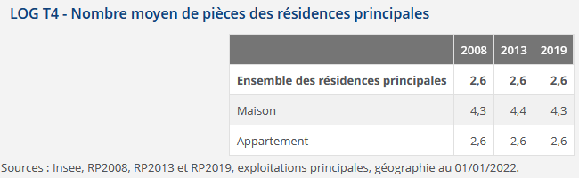

# (PART\*) Séance 2 : Data Mining - Analyse descriptive {-}


# Quelles questions intéressantes pour une "fouille de données" sur cette base ? {#c05-Questions-fouille-donnees}

<div align="justify">

Quelles sont les questions intéressantes que l'on peut se poser ? Qu'est-ce qu'on va pouvoir mettre en évidence à partir de ces données ?  

D'abord, on pourrait caractériser les logements fanciliens selon le type de logement (appartement, maison, HLM, ...), la superficie, le nombre de pièces, le nombre de personnes y habitant, le statut d'occupation (propriétaire, locataire, ...). Ensuite, on pourrait décrire plus précisément les pièces du logement en termes de confort (baignoire / douche, salle climatisée, moyen de chauffage), ainsi que les parties communes de l'immeuble (ascenseur, place de stationnement). Enfin, on pourrait étudier les caractéristiques des occupants de ces logements, et en premier lieu ici ce que l'Insee appelle la "personne de référence du ménage". Par ailleurs, toutes ces analyses peuvent être réalisées en  comparant les différentes communes de la région, ou à un niveau géographique plus fin par quartiers, arrondissements ou encore IRIS.   

Pour manipuler cette base et répondre à quelques-unes de ces questions, nous allons nous concentrer sur la commune de Paris, et allons chercher à reproduire des statistiques publiées sur le site de l'Insee. Nous produirons principalement, lors de cette séance, des tableaux de statistiques, l'analyse graphique fera en effet l'objet d'une séance entière car elle nécessite la présentation détaillée de la "grammaire" **`Ggplot`**.  
  
Avant cela, si les tables de données ("RP" et "meta") ne sont plus dans votre environnement local, il faut de nouveau les importer à partir de l'enregistrement précédemment effectué dans le dossier 'data' de votre projet. Pour cela, il faut utiliser la fonction `readRDS()`, comme ci-dessous :
```{r eval=FALSE, include=FALSE}
RP <- readRDS(file = "data/menages2019.Rdata")
meta <- readRDS(file = "data/menages2019_meta.Rdata")
```
  

## Caractéristiques des logements de la commune de Paris 
Sur le site de l'Insee, vous pouvez trouver les statistiques générales sur les logements à Paris en 2019 <a href="https://www.insee.fr/fr/statistiques/2011101?geo=DEP-75#chiffre-cle-3" target="_blank">ici</a>.  

Comme nous devons utiliser la pondération pour avoir des statistiques représentatives de la population française, une manière de faire est d'utiliser une méthode de comptage par variable catégorielle en indiquant la pondération à utiliser. La fonction `count()` avec l'argument `wt=` est un des moyens assez efficace d'y arriver. Cela nous donnera le nombre de ménages concernés par la caractéristique étudiée (par défaut, la variable créée s'appelle "n", on peut la renommer dans une étape ultérieure avec la fonction `rename()`). Souvent, c'est aussi les pourcentages que l'on souhaite avoir, il faudra alors créer une variable faisant la proportion de chaque catégorie sur le nombre total de logements, en utilisant la fonction `mutate()` et la fonction `prop.table()`. Le package **`janitor`** permet enfin d'ajouter une ligne totale (ou une colonne totale selon ce qu'on souhaite faire) avec la fonction `adorn_totals()`, argument "row" pour avoir le total en ligne.  

A partir de ces indications, afficher le tableau suivant à partir d'un code utilisant le langage **tidyverse** et en une seule procédure (sans nécessairement créer de table dans votre environnement) :
 
```{r echo=FALSE}
library(tidyverse)
library(janitor)
library(gt)
RP %>% 
  filter(COMMUNE == "75056") %>% 
  count(TYPL_moda, wt=IPONDL) %>% 
  mutate(Pourcentage=round(prop.table(n)*100, 1)) %>% 
  adorn_totals("row") %>% 
  rename(Effectif=n, 'Type de logement'=TYPL_moda) %>% 
  gt() %>% 
  fmt_number(columns = 2, sep_mark = " ", decimals = 0)
```
 
 <div class="solution-exo">
```{r message=FALSE, eval=FALSE}
library(tidyverse)
library(janitor)
library(gt)
RP %>% 
  filter(COMMUNE == "75056") %>% 
  count(TYPL_moda, wt=IPONDL) %>% 
  mutate(Pourcentage=round(prop.table(n)*100, 1)) %>% 
  adorn_totals("row") %>% 
  rename(Effectif=n, 'Type de logement'=TYPL_moda) %>% 
  gt() %>% 
  fmt_number(columns = 2, sep_mark = " ", decimals = 0)
```
</div>
\fi
Non sans grande surprise, la commune de Paris est constituée en majorité d'appartements, presque 97%.  

Cherchons maintenant la répartition des logements parisiens par type, est-ce plutôt des résidences principales ou secondaires ? combien y a-t-il de logements vacants ?
 
```{r echo=FALSE}
RP %>% 
  filter(COMMUNE == "75056") %>% 
  mutate(CATL_moda=case_when(CATL == "1" ~ "Résidences principales",
                             CATL == "2" ~ "Logements occasionnels",
                             CATL == "3" ~ "Résidences secondaires",
                             CATL == "4" ~ "Logements vacants",
                             TRUE ~ "Autres"),
         CATL_moda=fct_relevel(CATL_moda, c("Résidences principales", "Résidences secondaires",
                                            "Logements vacants", "Logements occasionnels"))) %>% 
  count(CATL_moda, wt=IPONDL) %>% 
  mutate(Pourcentage=round(prop.table(n)*100,1)) %>% 
  adorn_totals("row") %>% 
  rename(Effectif=n, 'Catégorie de logement'=CATL_moda) %>% 
  gt() %>% 
  fmt_number(columns = 2, sep_mark = " ", decimals = 0)
```
 
 <div class="solution-exo">
```{r message=FALSE, eval=FALSE}
RP %>% 
  filter(COMMUNE == "75056") %>% 
  mutate(CATL_moda=case_when(CATL == "1" ~ "Résidences principales",
                             CATL == "2" ~ "Logements occasionnels",
                             CATL == "3" ~ "Résidences secondaires",
                             CATL == "4" ~ "Logements vacants",
                             TRUE ~ "Autres"),
         CATL_moda=fct_relevel(CATL_moda, c("Résidences principales", "Résidences secondaires",
                                            "Logements vacants", "Logements occasionnels"))) %>% 
  count(CATL_moda, wt=IPONDL) %>% 
  mutate(Pourcentage=round(prop.table(n)*100, 1)) %>% 
  adorn_totals("row") %>% 
  rename(Effectif=n, 'Catégorie de logement'=CATL_moda) %>% 
  gt() %>% 
  fmt_number(columns = 2, sep_mark = " ", decimals = 0)
```
</div>
\fi
La plupart des logements parisiens sont des résidences principales (81,9%), alors que 6,2% sont des résidences secondaires ; à noter que la part des logements vacants n'est pas négligeable, elle s'élève à 8,7%.  
  
  
Maintenant, affichons la seule colonne 2019 de ce tableau tiré de l'Insee , en mettant la ligne "Ensemble des résidences principales" plutôt en fin de tableau (ces 2 usages sont possibles, question de préférence...) ; attention au champ sur lequel porte ces moyennes...  


 <div class="solution-exo">
```{r eval=FALSE}
RP %>% 
  filter(COMMUNE == "75056" & CATL== "1" & TYPL_moda != "Autres") %>% 
  group_by(TYPL_moda) %>%
  summarise('2019' = weighted.mean(as.numeric(as.character(NBPI)), IPONDL, na.rm=T)) %>%
  bind_rows(summarise(TYPL_moda = "Ensemble des résidences principales", 
                      RP[RP$COMMUNE == "75056" & RP$CATL == "1" & RP$TYPL_moda != "Autres",], 
                      '2019'  = weighted.mean(as.numeric(as.character(NBPI)), IPONDL, na.rm=T))) %>%
  rename(' ' = TYPL_moda) %>% 
  gt() %>% 
  fmt_number(columns = 2, dec_mark = ",", decimals = 1)
```
</div>
\fi

A Paris, sur les seules résidences principales, les maisons comportent plus de pièces que les appartements, presque 2 pièces de plus en moyenne. Etant donné que la majorité des logements est constituée par des appartements, la moyenne de l'ensemble des résidences principales est la même que celle des appartements.   
    
  
Etudions maintenant les résidences principales et l'ancienneté d'emménagement selon le statut d'occupation.  Attention, ici il faut procéder en plusieurs étapes : d'abord créer un tableau donnant la répartition en nombre et en pourcentage des ménages par statut d'occupation, puis créer un second tableau donnant la moyenne de l'ancienneté d'emménagement en années par statut d'occupation, puis fusionner ces deux tableaux.

```{r echo=FALSE}
t1 <- RP %>% 
  filter(COMMUNE == "75056" & CATL=="1" & STOCD != "0") %>% 
  mutate(st_occupation=case_when(STOCD=="10" ~ "Propriétaire",
                                 STOCD %in% c("21","22","23") ~ "Locataire",
                                 STOCD=="30" ~ "Logé gratuitement"),
         st_occupation=fct_relevel(st_occupation, c("Propriétaire", 
                                                    "Locataire",
                                                    "Logé gratuitement"))) %>% 
  count(st_occupation, wt=IPONDL) %>% 
  mutate(Pourcentage=round(prop.table(n)*100, 1)) %>%
  adorn_totals("row") %>% 
  rename(Nombre=n) 

t2 <- RP %>%
  filter(COMMUNE == "75056" & CATL=="1" & !STOCD %in% c("0", "ZZ")) %>%
  mutate(st_occupation=case_when(STOCD=="10" ~ "Propriétaire",
                                 STOCD %in% c("21","22","23") ~ "Locataire",
                                 STOCD=="30" ~ "Logé gratuitement"),
         st_occupation=fct_relevel(st_occupation, c("Propriétaire", 
                                                    "Locataire",
                                                    "Logé gratuitement"))) %>% 
  group_by(st_occupation) %>%
  summarise(anc_moy = weighted.mean(ANEM, IPONDL, na.rm=T)) %>%
  bind_rows(summarise(st_occupation = "Total", RP[RP$COMMUNE == "75056" & RP$CATL=="1" & !RP$STOCD %in% c("0", "ZZ"),], 
                      anc_moy = weighted.mean(ANEM, IPONDL, na.rm=T))) %>%
  mutate(anc_moy=round(anc_moy, 1)) %>% 
  rename("Ancienneté moyenne d'emménagement en année(s)"=anc_moy)

t1 %>% left_join(t2, by=join_by(st_occupation)) %>% 
  rename("Statut d'occupation"=st_occupation) %>% 
  gt()  %>% 
  fmt_number(columns = 2, sep_mark = " ", decimals = 0)
```

<div class="solution-exo">
```{r eval=FALSE}
t1 <- RP %>% 
  filter(COMMUNE == "75056" & CATL=="1" & STOCD != "0") %>% 
  mutate(st_occupation=case_when(STOCD=="10" ~ "Propriétaire",
                                 STOCD %in% c("21","22","23") ~ "Locataire",
                                 STOCD=="30" ~ "Logé gratuitement"),
         st_occupation=fct_relevel(st_occupation, c("Propriétaire", 
                                                    "Locataire",
                                                    "Logé gratuitement"))) %>% 
  count(st_occupation, wt=IPONDL) %>% 
  mutate(Pourcentage=round(prop.table(n)*100, 1)) %>%
  adorn_totals("row") %>% 
  rename(Nombre=n) 

t2 <- RP %>%
  filter(COMMUNE == "75056" & CATL=="1" & !STOCD %in% c("0", "ZZ")) %>%
  mutate(st_occupation=case_when(STOCD=="10" ~ "Propriétaire",
                                 STOCD %in% c("21","22","23") ~ "Locataire",
                                 STOCD=="30" ~ "Logé gratuitement"),
         st_occupation=fct_relevel(st_occupation, c("Propriétaire", 
                                                    "Locataire",
                                                    "Logé gratuitement"))) %>% 
  group_by(st_occupation) %>%
  summarise(anc_moy = weighted.mean(ANEM, IPONDL, na.rm=T)) %>%
  bind_rows(summarise(st_occupation = "Total", RP[RP$COMMUNE == "75056" & RP$CATL=="1" & !RP$STOCD %in% c("0", "ZZ"),], 
                      anc_moy = weighted.mean(ANEM, IPONDL, na.rm=T))) %>%
  mutate(anc_moy=round(anc_moy, 1)) %>% 
  rename("Ancienneté moyenne d'emménagement en année(s)"=anc_moy)

t1 %>% left_join(t2, by=join_by(st_occupation)) %>% 
  rename("Statut d'occupation"=st_occupation) %>% 
  gt()  %>% 
  fmt_number(columns = 2, sep_mark = " ", decimals = 0)
```
</div>
\fi

Il y a donc 1/3 de propriétaires à Paris quand on se concentre sur les résidences principales, et les propriétaires y sont présents depuis plus longtemps que les locataires : 18,2 ans en moyenne contre 10,3 ans.  
  

Enfin, on peut vouloir comparer la moyenne des pièces des appartements parisiens par arrondissement par exemple.  
```{r warning=FALSE, message=FALSE, echo=FALSE}
RP %>% 
  filter(COMMUNE == "75056" & CATL== "1" & TYPL_moda == "Appartement") %>% 
  group_by(ARM) %>%
  summarise(Moy_pieces = weighted.mean(as.numeric(as.character(NBPI)), IPONDL, na.rm=T)) %>%
  bind_rows(summarise(ARM = "Ensemble des appartements", 
                      RP[RP$COMMUNE == "75056" & RP$CATL == "1" & RP$TYPL_moda != "Appartement",], 
                      Moy_pieces = weighted.mean(as.numeric(as.character(NBPI)), IPONDL, na.rm=T))) %>%
  rename(Arrondissement=ARM, 'Nombre moyen de pièces'=Moy_pieces) %>% 
  gt() %>% 
  fmt_number(columns = 2, dec_mark = ",", decimals = 1)
```

<div class="solution-exo">
```{r eval=FALSE}
RP %>% 
  filter(COMMUNE == "75056" & CATL== "1" & TYPL_moda == "Appartement") %>% 
  group_by(ARM) %>%
  summarise(Moy_pieces = weighted.mean(as.numeric(as.character(NBPI)), IPONDL, na.rm=T)) %>%
  bind_rows(summarise(ARM = "Ensemble des appartements", 
                      RP[RP$COMMUNE == "75056" & RP$CATL == "1" & RP$TYPL_moda != "Appartement",], 
                      Moy_pieces = weighted.mean(as.numeric(as.character(NBPI)), IPONDL, na.rm=T))) %>%
  rename(Arrondissement=ARM, 'Nombre moyen de pièces'=Moy_pieces) %>% 
  gt() %>% 
  fmt_number(columns = 2, dec_mark = ",", decimals = 1)
```
</div>
\fi
  
  
Ainsi, si l'on veut créer des tableaux de répartition à une seule variable, on peut utiliser ces procédures qui se structurent toujours de la même façon. Au lieu de faire un copié-collé du code et de changer le nom des variables, autrement dit pour systématiser nos procédures, une astuce est de créer ses propres fonctions. C'est ce que nous allons étudier maintenant.


```{r eval=FALSE, include=FALSE}
RP %>% 
  filter(COMMUNE == "75056" & !SANI %in% c("X","Y","Z")) %>% 
  mutate(SANI_moda=case_when(SANI=="0" ~ "Ni baignoire, ni douche",
                             SANI=="1" ~ "Baignoire ou douche hors pièce réservée",
                             SANI=="2" ~ "Salle de bain avec baignoire ou douche")) %>% 
  count(SANI_moda, wt=IPONDL) %>% 
  mutate(Pourcentage=prop.table(n)*100, Pourcentage=round(Pourcentage, 1)) %>% 
  adorn_totals("row") %>% 
  rename(Effectif=n) %>% 
  gt() %>% 
  fmt_number(columns = 2, sep_mark = " ", decimals = 0)

t3 <- RP %>% 
       mutate(SANI_moda=case_when(SANI=="0" ~ "Ni baignoire, ni douche",
                             SANI=="1" ~ "Baignoire ou douche hors pièce réservée",
                             SANI=="2" ~ "Salle de bain avec baignoire ou douche")) %>% 
       tableau_bis(data=RP, COMMUNE == "75056" & !SANI %in% c("X","Y","Z"),
              var_quali=SANI_moda) %>% 
       select(SANI_moda=="Salle de bain avec baignoire ou douche") %>% 
       gt() %>%
       fmt_number(columns = 2, sep_mark = " ", decimals = 0)

# mes_filtres <- c("COMMUNE == '75056'", "!SANI %in% c('X','Y','Z')")
# tableau_bis(RP, mes_filtres, SANI) %>% 
#   gt() %>% 
#   fmt_number(columns = 2, sep_mark = " ", decimals = 0)

RP %>% 
  filter(COMMUNE == "75056" & !CHFL %in% c("X","Y","Z")) %>% 
  count(CHFL, wt=IPONDL) %>% 
  mutate(Pourcentage=prop.table(n)*100, Pourcentage=round(Pourcentage, 1)) %>% 
  adorn_totals("row") %>% 
  rename(Effectif=n) %>% 
  gt() %>% 
  fmt_number(columns = 2, sep_mark = " ", decimals = 0)

# RP %>% filter(!CHFL %in% c("X","Y","Z")) %>%
# tableau(filtre_com = "75056", var_quali=CHFL) %>%
#   gt() %>%
#   fmt_number(columns = 2, sep_mark = " ", decimals = 0)

RP %>%
  filter(COMMUNE == "75056" & ANEMR != "99") %>%
  mutate(anc_emm=case_when(ANEMR == "0" ~ "Depuis moins de 2 ans",
                           ANEMR == "1" ~ "De 2 à 4 ans",
                           ANEMR == "2" ~ "De 5 à 9 ans",
                           TRUE ~ "10 ans ou plus"),
         anc_emm = fct_relevel(anc_emm, c("Depuis moins de 2 ans", "De 2 à 4 ans",
                                          "De 5 à 9 ans", "10 ans ou plus"))) %>% 
  count(anc_emm, wt=IPONDL) %>% 
  mutate(Pourcentage=prop.table(n)*100, Pourcentage=round(Pourcentage, 1)) %>% 
  adorn_totals("row") %>% 
  rename(Effectif=n) %>% 
  gt() %>% 
  fmt_number(columns = 2, sep_mark = " ", decimals = 0)

# RP %>% filter(ANEMR != "99") %>%
#   mutate(anc_emm=case_when(ANEMR == "0" ~ "Depuis moins de 2 ans",
#                            ANEMR == "1" ~ "De 2 à 4 ans",
#                            ANEMR == "2" ~ "De 5 à 9 ans",
#                            TRUE ~ "10 ans ou plus"),
#          anc_emm = fct_relevel(anc_emm, c("Depuis moins de 2 ans", "De 2 à 4 ans",
#                                           "De 5 à 9 ans", "10 ans ou plus"))) %>% 
# tableau(filtre_com="75056", var_quali=anc_emm) %>%
#   gt() %>%
#   fmt_number(columns = 2, sep_mark = " ", decimals = 0)

RP %>%
  filter(COMMUNE == "75056" & ANEMR != "99") %>%
  mutate(anc_emm=case_when(ANEMR == "0" ~ "Depuis moins de 2 ans",
                           ANEMR == "1" ~ "De 2 à 4 ans",
                           ANEMR == "2" ~ "De 5 à 9 ans",
                           TRUE ~ "10 ans ou plus"),
         anc_emm = fct_relevel(anc_emm, c("Depuis moins de 2 ans", "De 2 à 4 ans",
                                          "De 5 à 9 ans", "10 ans ou plus")),
         nb_pieces=as.numeric(as.character(NBPI))) %>%
  group_by(anc_emm) %>%
  summarise(Np_pieces_moy = weighted.mean(nb_pieces, IPONDL, na.rm=T)) %>%
  bind_rows(summarise(anc_emm = "Total", RP[RP$ANEMR != "99" & RP$COMMUNE == "75056",], Np_pieces_moy = weighted.mean(as.numeric(as.character(NBPI)), IPONDL, na.rm=T))) %>%
  mutate(Np_pieces_moy=round(Np_pieces_moy, 1)) 

RP %>%
  filter(COMMUNE == "75056" & STOCD == "10") %>%
  group_by(IRIS) %>%
  summarise(nb_proprietaires = round(sum(IPONDL))) %>% 
  get_summary_stats(nb_proprietaires)
  #ggplot() + aes(x=nb_proprietaires) + geom_histogram(bins=50)
```


## Systématiser nos procédures : construire une fonction
<div align="justify">

Pour ré-utiliser un code de façon plus automatique, créer des fonctions est très utile (et on peut même les stocker dans un fichier `.r` pour les réutiliser plus tard pour une autre étude).   

L'idée est qu'à partir d'un bloc d'instructions ou de lignes de codes, on l'intègre dans une fonction qui portera un nom et qui pourra être appliquée sur les paramètres que l'on veut (table/objet différent, variables différentes) et qui nous retournera une valeur en sortie (qu'il faut préciser donc). Par exemple : 
```{r eval=FALSE}
# Exemple fonction avec 3 arguments
nom_fonction <- function(data, var1, var2) {
  
  expression...  # Ce que la fonction fait
  
  return()  # Optionnel, mais la plupart du temps utilisé (!), 
               # pour sortir le résultat de la fonction
  
}

# L'appel de la fonction devra ainsi préciser la table de données sur laquelle 
# l'appliquer et les autres arguments : 
nom_fonction(data = nom_de_ma_table , var1 = nom_de_ma_variable1,  
             var2 = nom_de_ma_variable2)

# De plus, on pourra créer un nouvel objet (ici "tab_var") pour stocker la table 
# qui est en valeur de sortie de la fonction : 
tab_var <- nom_fonction(data = nom_de_ma_table , var1 = nom_de_ma_variable1,
                        var2 = nom_de_ma_variable2)
```
Les arguments doivent donc être précisés en entrée de notre fonction, si on ne les précise pas cela nous retournera une erreur... à moins que l'on ait spécifié des valeurs par défaut (ce qui peut être utile si on utilise souvent les mêmes paramètres, par exemple la même base de données) ; il peut y avoir autant d'arguments que l'on souhaite.  

Si l'on utilise le langage tidyverse, il faut connaître quelques petits "trucs" pour écrire une fonction. Le schéma suivant réalisé par Julien Barnier du CNRS nous sera très utile.  


<div align="center">
*Source* : Julien Barnier, <a href="https://twitter.com/lapply/status/1493908215796535296?s=20&t=p4aYIEV4GsGS3TGftPa0Nw" target="_blank">https://twitter.com/lapply/status/1493908215796535296?s=20&t=p4aYIEV4GsGS3TGftPa0Nw</a>.  
   

<div align="justify"> 
Vous trouverez également des informations utiles <a href="https://thinkr.fr/comment-creer-des-fonctions-dans-le-tidyverse-avec-la-tidyeval-et-le-stash-stash/" target="_blank">ici</a> ou <a href="https://www.vishalkatti.com/posts/2021-07-17-programmingwithdplyr/" target="_blank">là</a>.  


On peut d'abord créer une fonction reprenant le code précédent pour la construction de tableau. On l'appelle `tableau`, et on lui donne comme arguments "data", "filtre_com", "var_quali", "pond" et "nom_var_quali". 

Dans le langage tidyverse, au sein d'une fonction, il faut appeler une variable avec des doubles-accolades `{{  }}`.  

Si l'on utilise une fonction `summarise()`, une autre subtilité à connaître est que cette syntaxe `summarise({{ nom_var }} = mean({{ var }}, na.rm=TRUE))` ne sera pas reconnue, car il faut indiquer non pas un "=" mais un ":=" pour que la fonction puisse être lue lorsque le nom donné à la variable est de type caractère ou "string".    

Enfin, il ne faut pas oublier de retourner un objet en sortie avec `return()`.   
   
   
Essayez donc de créer une fonction `tableau()`, reprenant le premier code de la section précédente et remise ci-dessous pour information : 
```{r}
RP %>% 
  filter(COMMUNE == "75056") %>% 
  count(TYPL_moda, wt=IPONDL) %>% 
  mutate(Pourcentage=prop.table(n)*100, Pourcentage=round(Pourcentage, 1)) %>% 
  adorn_totals("row") %>% 
  rename(Effectif=n, 'Type de logement'=TYPL_moda) %>% 
  gt() %>% 
  fmt_number(columns = 2, sep_mark = " ", decimals = 0)
```

<div class="solution-exo">
```{r message=FALSE}
# library(tidyverse)
# library(janitor)
# library(gt)
tableau <- function(data, filtre_com, var_quali, pond=IPONDL, nom_var_quali){
  
  tab <- data %>% 
    filter(COMMUNE == filtre_com) %>% 
    count({{ var_quali }}, wt={{ pond }}) %>% 
    mutate(Pourcentage=prop.table(n)*100, Pourcentage=round(Pourcentage, 1)) %>% 
    adorn_totals("row") %>% 
    rename(Effectif=n, {{nom_var_quali}}:={{ var_quali }}) 
  
  return(tab)
  
}
```
</div>
\fi

On peut vérifier qu'on obtient bien la même chose :
```{r}
tableau(data=RP, filtre_com="75056", var_quali=TYPL_moda, nom_var_quali="Type de logement") %>% 
  gt() %>% 
  fmt_number(columns = 2, sep_mark = " ", decimals = 0)
```


<!--Et on peut tester cette fonction, par exemple pour calculer la proposition de logements HLM parmi les résidences principales dans Paris :  -->
```{r eval=FALSE, include=FALSE}
RP %>% 
  filter(CATL== "1") %>% 
  mutate(log_HLM=case_when(HLML=="1" ~ "Logement HLM",
                           HLML=="2" ~ "Logement non HLM")) %>% 
  tableau(filtre_com="75056", var_quali=log_HLM, nom_var_quali="Type de logement") %>% 
  gt() %>% 
  fmt_number(columns = 2, sep_mark = " ", decimals = 0)

# OU :
RP %>% 
  filter(COMMUNE == "75056" & CATL=="1" & STOCD != "0") %>% 
  mutate(st_occupation=case_when(STOCD=="10" ~ "Propriétaire",
                                 STOCD %in% c("21","22","23") ~ "Locataire",
                                 STOCD=="30" ~ "Logé gratuitement"),
         st_occupation=fct_relevel(st_occupation, c("Propriétaire", 
                                                    "Locataire",
                                                    "Logé gratuitement")),
         log_HLM=case_when(HLML=="1" ~ "Logement HLM",
                           HLML=="2" ~ "Logement non HLM")) %>% 
  group_by(st_occupation) %>% 
  count(log_HLM, wt=IPONDL)

  mutate(Pourcentage=prop.table(n)*100, Pourcentage=round(Pourcentage, 1)) %>% 
  adorn_totals("row") %>% 
  rename(Effectif=n) 
  

Tabcr_pctcol <- function(data, var1, var2, pond=IPONDL, nom_var1){
  tabcroisefin <- data %>% group_by({{var2}})  %>% 
    count({{var1}}, wt={{pond}}) %>% pivot_wider(names_from = {{var1}}, values_from = "n", names_prefix = paste0(nom_var1,"_")) %>% 
    adorn_totals(c("row",'col')) %>% adorn_percentages("col") %>% adorn_pct_formatting(digits=2) 
  return(tabcroisefin)
}

RP %>% 
  filter(COMMUNE=="75056" & CATL=="1" & STOCD != "0" & TYPL_moda != "Autres") %>% 
  mutate(st_occupation=case_when(STOCD=="10" ~ "Propriétaire",
                                 STOCD %in% c("21","22","23") ~ "Locataire",
                                 STOCD=="30" ~ "Logé gratuitement"),
         st_occupation=fct_relevel(st_occupation, c("Propriétaire", 
                                                    "Locataire",
                                                    "Logé gratuitement"))) %>% 
  Tabcr_pctcol(var1=TYPL_moda, var2=st_occupation, nom_var1="") %>% 
  rename("Statut d'occupation"=st_occupation, "Maison"='_Maison', "Appartement"='_Appartement') %>%  
  gt()
  
```


```{r eval=FALSE, include=FALSE}
tableau_bis <- function(data, vars_filtre, var_quali, pond=IPONDL){
  
  text_filtre <- paste0("(", vars_filtre, ")", collapse = " & ")
  
  tab1 <- data %>% 
    filter(eval(parse(text = text_filtre))) %>% 
    count({{ var_quali }}, wt={{ pond }}) %>% 
    mutate(Pourcentage=prop.table(n)*100, Pourcentage=round(Pourcentage, 1)) %>% 
    adorn_totals("row") %>% 
    rename(Effectif=n, Variable={{ var_quali }})
  
  return(tab1)
  
}

mes_filtres <- c("COMMUNE == '75056'", "!SANI %in% c('X','Y')")
tableau_bis(RP, mes_filtres, SANI) %>% 
  gt() %>% 
  fmt_number(columns = 2, sep_mark = " ", decimals = 0)

# tableau_bis <- function(data, ..., var_quali, pond=IPONDL){
#   
#   tab <- data %>% 
#     filter(...) %>% 
#     count({{ var_quali }}, wt={{ pond }}) %>% 
#     mutate(Pourcentage=prop.table(n)*100, Pourcentage=round(Pourcentage, 1)) %>% 
#     adorn_totals("row") %>% 
#     rename(Effectif=n, Variable={{ var_quali }}) 
#   
#   return(tab)
#   
# }

```


Essayez d'écrire une seconde fonction `somme()` permettant de systématiser le code suivant qui donne un tableau de contingence du nombre de propriétaires par IRIS (cela nous servira pour plus tard...), en ajoutant une fonction de filtre qui peut contenir plusieurs variables. Pour cela, on va utiliser l'argument "..." (lire "dot") : cet argument est très pratique si l'on ne sait pas combien il y aura de variable(s) dans la fonction à laquelle elle s'applique, c'est-à-dire autant 0 variable, 1 variable ou plus d'une variable ; mais elle peut aussi être "dangereuse" si on ne se souvient plus qu'on l'a créée et/ou si on ne fait pas attention à bien remplir les autres arguments avec les noms correspondants.   

On va également introduire la fonction `group_by()` pour avoir les tableaux de contingence par IRIS.  
```{r}
RP %>%
  filter(COMMUNE == "75056" & STOCD == "10") %>%
  group_by(IRIS) %>%
  summarise(nb_proprietaires = sum(IPONDL)) %>% 
  mutate(nb_proprietaires=round(nb_proprietaires, 0))
```

<div class="solution-exo">
```{r}
somme <- function(data, ..., var_gpe, nom_var, var1){
  
  som_1 <- data %>% 
    filter(...) %>% 
    group_by({{var_gpe}}) %>% 
    summarise({{nom_var}}:=sum({{var1}}, na.rm=T)) %>% 
    mutate({{nom_var}}:=round({{nom_var}}, 0))
  
  return(som_1)
  
}
```
</div>
\fi 

Vérifions :
```{r}
somme(data=RP, COMMUNE == "75056" & STOCD == "10", 
      var_gpe=IRIS, nom_var=nb_proprietaires, var1=IPONDL) 
```


La création de fonctions est donc très utile pour avoir un code plus efficace ; il faut toutefois réfléchir à son usage avant de la créer pour savoir à quel point il faut systématiser les procédures utilisées, certains éléments devant être laissés probablement en-dehors de la fonction, comme dans l'exemple précédent le fait d'arrondir les chiffres. Il faut par ailleurs toujours vérfier, sur un ou deux exemples, que la fonction fonctionne bien, c'est-à-dire donne les mêmes résultats que le code initial.  

Pour pouvoir les réutiliser ultérieurement, on peut les réécrire dans un nouveau script qu'on enregistre dans un dossier de notre projet qu'on intitule "fonctions" ; il suffira ensuite d'appeler ce programme avec la fonction `source()` :
```{r eval=FALSE}
source("fonctions/fonctions.R")
```


