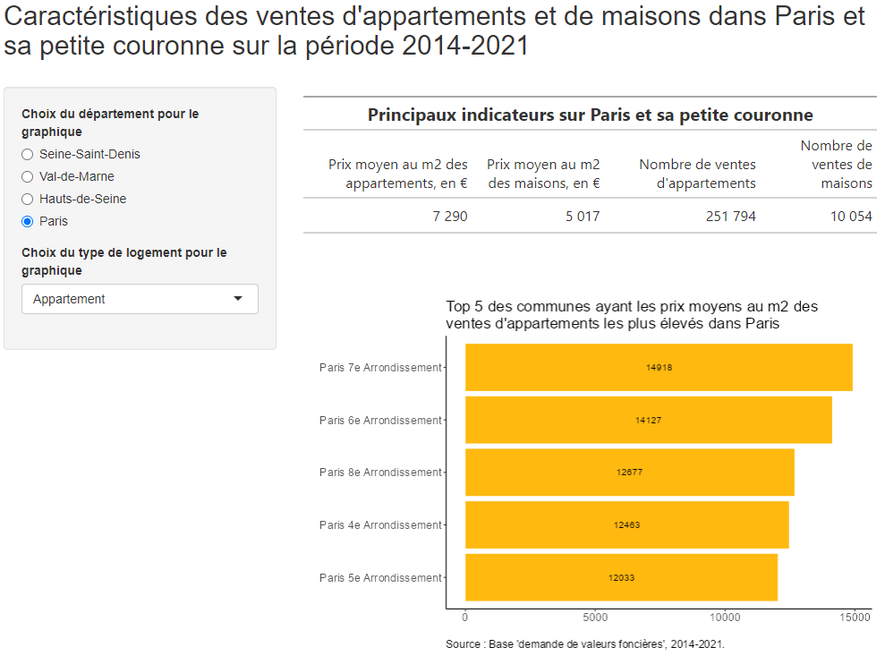
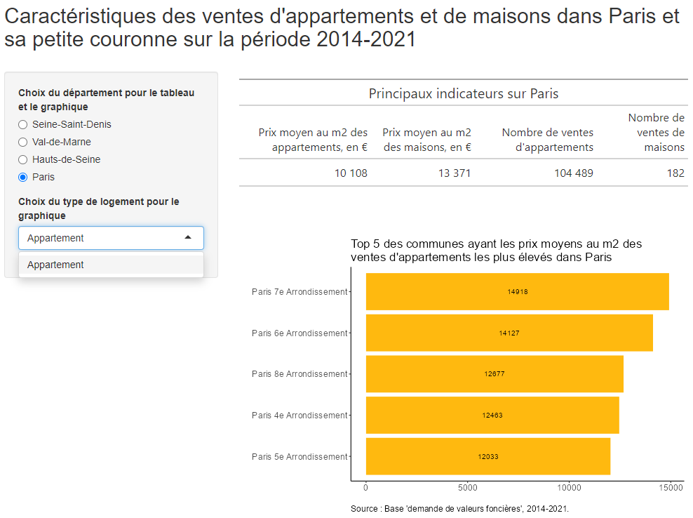
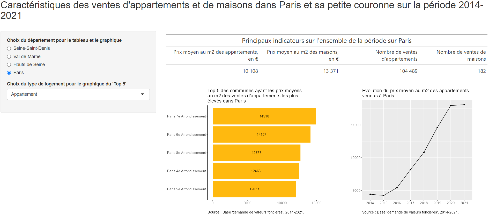

# Application sur Shiny  {#c10-Retour-sur-Shiny}
<div align="justify">

Nous pouvons maintenant mettre en pratique ces connaissances plus approfondies acquises sur le package **`Ggplot`**, en créant une application Shiny dont nous avions vu les bases lors de séances précédentes.


## Application avec un tableau et un graphique
On va d'abord créer une application en mettant en haut un tableau général récapitulant  pour la zone géographique étudiée les informations suivantes : le prix moyen au m2 et le nombre de ventes, respectivement des appartements et des maisons ; puis en-dessous de ce tableau, on va ajouter un graphique (barplot) qui va représenter le "top 5" du prix moyen au m2 des ventes, soit d'appartements, soit de maisons, et selon le département.  
Ainsi, le premier tableau ne sera pas à ce stade réactif, alors que le graphique le sera. Il y aura par conséquent deux widgets, l'un pour choisir le département et l'autre pour choisir le type de logement
Pour le tableau, vous pouvez utiliser le package **`gt()`** et la fonction `gt_output()` pour l'appel du tableau dans la partie **UI** associée à la fonction `render_gt()` dans la partie **server**.  
  
Cela doit vous donner ceci :

```{r eval=FALSE, include=FALSE}
dvf <- readRDS("data/dvfclean_V3.RDS")
```

```{r eval=FALSE}
# Chargement des librairies
library(shiny)
library(tidyverse)
library(gt)
library(RColorBrewer)
library(forcats)


# Chargement du fichier final
# dvf <- readRDS("data/dvfclean_V3.RDS")


# Définition UI et Server de l'application Shiny
ui <- fluidPage(
  # Titre de l'application
  titlePanel("Caractéristiques des ventes d'appartements et de maisons dans Paris et sa petite couronne sur la période 2014-2021"),
  
  br(),
  
  # Définition du Widget
  sidebarLayout(
    sidebarPanel(
      radioButtons(inputId = "dept", 
                   label = "Choix du département pour le graphique",
                   choices = unique(dvf$nom_dept),
                   selected = "Paris"),
      selectInput(inputId = "type_logement", 
                  label = "Choix du type de logement pour le graphique", 
                  choices = list("Appartement", "Maison"),
                  selected = "Appartement")
      ),
    
    # Tableau et graphe montré à l'utilisateur
    mainPanel(
      gt_output("tab"),
      
      br(),
      br(),
      br(),
      
      plotOutput("barplot")    
    )
  )
)


server <- function(input, output) {
  
  output$tab <- render_gt({
    dvf %>% 
      summarise("Prix moyen au m2 des appartements, en €" = round(mean(dvf[dvf$type=="Appartement", ]$prixm2)),
            "Prix moyen au m2 des maisons, en €" = round(mean(dvf[dvf$type=="Maison", ]$prixm2)),
            "Nombre de ventes d'appartements" = sum(dvf[dvf$type=="Appartement", ]$nblots),
            "Nombre de ventes de maisons" = sum(dvf[dvf$type=="Maison", ]$nblots)) %>% 
      gt() %>%  
      fmt_number(columns= 1:4, sep_mark = " ", decimals = 0) %>% 
      tab_header(title=md('**Principaux indicateurs sur Paris et sa petite couronne**'))
  })


  output$barplot <- renderPlot({
  dvf %>% 
  filter(type == input$type_logement & nom_dept == input$dept) %>% 
  group_by(nom) %>%  
  summarise(moy_prixm2 = round(mean(prixm2))) %>% 
      arrange(desc(moy_prixm2)) %>% slice(1:5) %>% 
      ggplot() + aes(x = moy_prixm2, y = fct_reorder(nom, moy_prixm2))  + 
      geom_bar(stat="identity", fill="darkgoldenrod1")  +
      geom_text(aes(label=moy_prixm2), position = position_stack(vjust=0.5), size=3.8) +
      labs(title = paste("Top 5 des communes ayant les prix moyens au m2 des \nventes", 
                       if(input$type_logement=="Appartement"){"d'appartements"} else{"de maisons"}, "les plus élevés",
                       ifelse(input$dept=="Paris", "dans Paris", 
                              ifelse(input$dept=="Seine-Saint-Denis", "en Seine-Saint-Denis",
                                     ifelse(input$dept=="Hauts-de-Seine", "dans les Hauts-de-Seine", "dans le Val-de-Marne")))),
           x=" ", y=" ",
           caption = "Source : Base 'demande de valeurs foncières', 2014-2021.") +
      theme_classic() +
      theme(plot.title = element_text(size=17),
            plot.caption = element_text(hjust = 0, size=12),
            axis.text.y = element_text(size=12.5),
            axis.text.x = element_text(size=12.5))
    
  })
  
}


shinyApp(ui = ui, server = server)
```

Par rapport aux exemples précédents déjà réalisés sur Shiny, nous n'avons pas beaucoup ajouté de choses nouvelles : un peu de langage html (`br()`) pour insérer des espaces entre le tableau et le graphique, ou le titre général et le reste des éléments de l'application ; puis deux fonctions de condition à l'intérieur du `labs()` de **`Ggplot`** pour, d'une part, que le titre change selon le type de logement choisi par l'utilisateur (fonction `if(){} else{}`), et, d'autre part, que le titre change selon le département choisi (plusieurs fonctions `ifelse()`).  


## Introduction d'une réactivité appliquée à la table de données
On peut rendre maintenant la base de données réactive avec la fonction `reactive({})`. On l'avait vu, la fonction `reactive()` permet de créer un objet réactif qui est à la fois une entrée réactive et une sortie réactive, l’objet va donc se mettre à jour automatiquement si les entrées qu’il utilise changent, et il va automatiquement déclencher la mise à jour des sorties où il est utilisé.  
La fonction permet techniquement de décomposer du code réactif et est utile lorsque certaines parties du code sont utilisées par plusieurs outputs car elle va permettre alors d'éviter des redondances. Cela peut être le cas lorsqu'on doit filtrer et/ou sélectionner des mêmes variables en input pour plusieurs outputs.  
Ici, on va décomposer la partie 'data' du code précédent de la partie construction du graphique ; le rendu sera strictement le même ; mais cela peut être plus efficace en cas de long code et d'application complexe car en gros on va exécuter qu'une seule fois l'opération 'data' réalisée ici.  
Attention, la base réactive créée est une fonction, il faut donc l'appeler avec des parenthèses !

```{r eval=FALSE}
# Chargement du fichier final
# dvf <- readRDS("data/dvfclean_V3.RDS")


# Définition UI et Server de l'application Shiny
ui <- fluidPage(
  # Titre de l'application
  titlePanel("Caractéristiques des ventes d'appartements et de maisons dans Paris et sa petite couronne sur la période 2014-2021"),
  
  br(),
  
  # Définition du Widget
  sidebarLayout(
    sidebarPanel(
      radioButtons(inputId = "dept", 
                   label = "Choix du département pour le graphique",
                   choices = unique(dvf$nom_dept),
                   selected = "Paris"),
      selectInput(inputId = "type_logement", 
                  label = "Choix du type de logement pour le graphique", 
                  choices = list("Appartement", "Maison"),
                  selected = "Appartement")
      ),
    
    # Tableau et graphe montré à l'utilisateur
    mainPanel(
      gt_output("tab"),
      
      br(),
      br(),
      br(),
      
      plotOutput("barplot")    
    )
  )
)


server <- function(input, output) {
  
  output$tab <- render_gt({
    dvf %>% 
      summarise("Prix moyen au m2 des appartements, en €" = round(mean(dvf[dvf$type=="Appartement", ]$prixm2)),
            "Prix moyen au m2 des maisons, en €" = round(mean(dvf[dvf$type=="Maison", ]$prixm2)),
            "Nombre de ventes d'appartements" = sum(dvf[dvf$type=="Appartement", ]$nblots),
            "Nombre de ventes de maisons" = sum(dvf[dvf$type=="Maison", ]$nblots)) %>% 
      gt() %>%  
      fmt_number(columns= 1:4, sep_mark = " ", decimals = 0) %>% 
      tab_header(title=md('**Principaux indicateurs sur Paris et sa petite couronne**'))
  })

  dvf_react <- reactive({
  dvf %>% 
  filter(type == input$type_logement & nom_dept == input$dept) %>% 
  group_by(nom) %>%  
  summarise(moy_prixm2 = round(mean(prixm2))) %>% 
      arrange(desc(moy_prixm2)) %>% slice(1:5)
  })

  output$barplot <- renderPlot({
  dvf_react() %>% 
      ggplot() + aes(x = moy_prixm2, y = fct_reorder(nom, moy_prixm2))  + 
      geom_bar(stat="identity", fill="darkgoldenrod1")  +
      geom_text(aes(label=moy_prixm2), position = position_stack(vjust=0.5), size=3.8) +
      labs(title = paste("Top 5 des communes ayant les prix moyens au m2 des \nventes", 
                       if(input$type_logement=="Appartement"){"d'appartements"} else{"de maisons"}, "les plus élevés",
                       ifelse(input$dept=="Paris", "dans Paris", 
                              ifelse(input$dept=="Seine-Saint-Denis", "en Seine-Saint-Denis",
                                     ifelse(input$dept=="Hauts-de-Seine", "dans les Hauts-de-Seine", "dans le Val-de-Marne")))),
           x=" ", y=" ",
           caption = "Source : Base 'demande de valeurs foncières', 2014-2021.") +
      theme_classic() +
      theme(plot.title = element_text(size=17),
            plot.caption = element_text(hjust = 0, size=12),
            axis.text.y = element_text(size=12.5),
            axis.text.x = element_text(size=12.5))
    
  })
  
}


shinyApp(ui = ui, server = server)
```


## Introduction d'une réactivité sur les inputs (contexte réactif)
On va maintenant rendre le tableau réactif selon le département choisi.  
Mais surtout, on va introduire un contexte réactif. En effet, lorsque l'analyse porte sur Paris, choisir comme type de logement des maisons n'est pas pertinent car il n'y a pratiquement pas de maisons vendues dans Paris, donc on va faire en sorte que lorsque l'utilisateur choisit Paris, il n'est plus le choix du type de logement, seuls les appartements apparaîtront, mais lorsqu'il cliquera sur un autre département, alors les deux types de logements seront de nouveau possible.  
 
On peut pour cela utiliser la fonction `observe()` : on l'utilise donc quand un input change.  
Il va falloir ici utiliser à l'intérieur de la fonction `observe()` une condition `if ... else ...` : on part du principe qu'on affiche d'abord automatiquement "Paris", lorsque l'utilisateur appuie sur le bouton du choix de département du  widget `radioButtons`, le widget `selectInput` doit être actualisé en permettant un choix unique, "appartements" ; alors que quand il appuie sur un autre département sur le bouton du choix de département du  widget `radioButtons`, le `selectInput` laisse le choix entre "appartements" et "maisons.   

Il faut donc utiliser la fonction `observe()`, une condition `if ... else ...` et une actualisation des widgets avec la fonction `updateSelectInput()`.  

L'image suivante vous donne un aperçu de ce qu'on devrait avoir pour Paris : 

```{r eval=FALSE}
# Chargement du fichier final
# dvf <- readRDS("data/dvfclean_V3.RDS")


# Définition UI et Server de l'application Shiny
ui <- fluidPage(
  # Titre de l'application
  titlePanel("Caractéristiques des ventes d'appartements et de maisons dans Paris et sa petite couronne sur la période 2014-2021"),
  
  br(),
  
  # Définition du Widget
  sidebarLayout(
    sidebarPanel(
      radioButtons(inputId = "dept", 
                   label = "Choix du département pour le tableau et le graphique",
                   choices = unique(dvf$nom_dept),
                   selected = "Paris"),
      selectInput(inputId = "type_logement", 
                  label = "Choix du type de logement pour le graphique", 
                  choices = list("Appartement", "Maison"),
                  selected = "Appartement")
      ),
    
    # Tableau et graphe montré à l'utilisateur
    mainPanel(
      gt_output("tab"),
      
      br(),
      br(),
      br(),
      
      plotOutput("barplot")    
    )
  )
)


server <- function(input, output) {
  
  output$tab <- render_gt({
    dvf %>% 
      summarise("Prix moyen au m2 des appartements, en €" = round(mean(dvf[dvf$type=="Appartement" & nom_dept == input$dept, ]$prixm2)),
            "Prix moyen au m2 des maisons, en €" = round(mean(dvf[dvf$type=="Maison" & nom_dept == input$dept, ]$prixm2)),
            "Nombre de ventes d'appartements" = sum(dvf[dvf$type=="Appartement" & nom_dept == input$dept, ]$nblots),
            "Nombre de ventes de maisons" = sum(dvf[dvf$type=="Maison" & nom_dept == input$dept, ]$nblots)) %>% 
      gt() %>%  
      fmt_number(columns= 1:4, sep_mark = " ", decimals = 0) %>% 
      tab_header(title=paste('Principaux indicateurs sur', ifelse(input$dept=="Paris", "Paris", 
                              ifelse(input$dept=="Seine-Saint-Denis", "la Seine-Saint-Denis",
                                     ifelse(input$dept=="Hauts-de-Seine", "les Hauts-de-Seine", "le Val-de-Marne")))))
  })

  observe({
    input$dept
    if(input$dept == "Paris"){
      updateSelectInput(inputId = "type_logement",
                        choices = list("Appartement"),
                        selected = "Appartement")
      } 
    else {updateSelectInput(inputId = "type_logement",
                            choices = list("Appartement", "Maison"),
                            selected = input$variable)
    }
  })
  
  dvf_react <- reactive({
  dvf %>% 
  filter(type == input$type_logement & nom_dept == input$dept) %>% 
  group_by(nom) %>%  
  summarise(moy_prixm2 = round(mean(prixm2))) %>% 
      arrange(desc(moy_prixm2)) %>% slice(1:5)
  })

  output$barplot <- renderPlot({
  dvf_react() %>% 
      ggplot() + aes(x = moy_prixm2, y = fct_reorder(nom, moy_prixm2))  + 
      geom_bar(stat="identity", fill="darkgoldenrod1")  +
      geom_text(aes(label=moy_prixm2), position = position_stack(vjust=0.5), size=3.8) +
      labs(title = paste("Top 5 des communes ayant les prix moyens au m2 des \nventes", 
                       if(input$type_logement=="Appartement"){"d'appartements"} else{"de maisons"}, "les plus élevés",
                       ifelse(input$dept=="Paris", "dans Paris", 
                              ifelse(input$dept=="Seine-Saint-Denis", "en Seine-Saint-Denis",
                                     ifelse(input$dept=="Hauts-de-Seine", "dans les Hauts-de-Seine", "dans le Val-de-Marne")))),
           x=" ", y=" ",
           caption = "Source : Base 'demande de valeurs foncières', 2014-2021.") +
      theme_classic() +
      theme(plot.title = element_text(size=17),
            plot.caption = element_text(hjust = 0, size=12),
            axis.text.y = element_text(size=12.5),
            axis.text.x = element_text(size=12.5))
    
  })
  
}


shinyApp(ui = ui, server = server)
```
  
  
  
On peut ajouter un second graphique donnant une information sur l'évolution des prix moyen au m2 par type de logement et département sur la période étudiée.  

L'image suivante vous donne un aperçu de ce qu'on devrait avoir : 
 

```{r eval=FALSE}
library(shinyWidgets)

# Chargement du fichier final
# dvf <- readRDS("data/dvfclean_V3.RDS")


# Définition UI et Server de l'application Shiny
ui <- fluidPage(
  # Titre de l'application
  titlePanel("Caractéristiques des ventes d'appartements et de maisons dans Paris et sa petite couronne sur la période 2014-2021"),
  
  br(),
  
  # Définition du Widget
  sidebarLayout(
    sidebarPanel(
      radioButtons(inputId = "dept", 
                   label = "Choix du département pour le tableau et le graphique",
                   choices = unique(dvf$nom_dept),
                   selected = "Paris"),
      selectInput(inputId = "type_logement", 
                  label = "Choix du type de logement pour le graphique du 'Top 5'", 
                  choices = list("Appartement", "Maison"),
                  selected = "Appartement")
      ),
    
    # Tableau et graphe montré à l'utilisateur
    mainPanel(
      gt_output("tab"),
      br(),
      fluidRow(
        splitLayout(cellWidths = c("55%", "45%"),
                    plotOutput("barplot",  height = 400, width = 500),
                    plotOutput("courbe",  height = 400, width = 400))
      )
 
    )
  )
)


server <- function(input, output) {
  
  output$tab <- render_gt({
    dvf %>% 
      summarise("Prix moyen au m2 des appartements, en €" = round(mean(dvf[dvf$type=="Appartement" & nom_dept == input$dept, ]$prixm2)),
            "Prix moyen au m2 des maisons, en €" = round(mean(dvf[dvf$type=="Maison" & nom_dept == input$dept, ]$prixm2)),
            "Nombre de ventes d'appartements" = sum(dvf[dvf$type=="Appartement" & nom_dept == input$dept, ]$nblots),
            "Nombre de ventes de maisons" = sum(dvf[dvf$type=="Maison" & nom_dept == input$dept, ]$nblots)) %>% 
      gt() %>%  
      fmt_number(columns= 1:4, sep_mark = " ", decimals = 0) %>% 
      tab_header(title=paste("Principaux indicateurs sur l'ensemble de la période sur", 
                             ifelse(input$dept=="Paris", "Paris", 
                              ifelse(input$dept=="Seine-Saint-Denis", "la Seine-Saint-Denis",
                                     ifelse(input$dept=="Hauts-de-Seine", "les Hauts-de-Seine", "le Val-de-Marne")))))
  })

  observe({
    input$dept
    if(input$dept == "Paris"){
      updateSelectInput(inputId = "type_logement",
                        choices = list("Appartement"),
                        selected = "Appartement")
      } 
    else {updateSelectInput(inputId = "type_logement",
                            choices = list("Appartement", "Maison"),
                            selected = input$variable)
    }
  })
  
  dvf_react <- reactive({
  dvf %>% 
  filter(type == input$type_logement & nom_dept == input$dept) 
  })

  output$barplot <- renderPlot({
  dvf_react() %>% 
      group_by(nom) %>%  
      summarise(moy_prixm2 = round(mean(prixm2))) %>% 
      arrange(desc(moy_prixm2)) %>% slice(1:5) %>% 
      
      ggplot() + aes(x = moy_prixm2, y = fct_reorder(nom, moy_prixm2))  + 
      geom_bar(stat="identity", fill="darkgoldenrod1")  +
      geom_text(aes(label=moy_prixm2), position = position_stack(vjust=0.5), size=3.8) +
      labs(title = paste("Top 5 des communes ayant les prix moyens \nau m2 des ventes", 
                       if(input$type_logement=="Appartement"){"d'appartements"} else{"de maisons"}, "les plus \nélevés",
                       ifelse(input$dept=="Paris", "dans Paris", 
                              ifelse(input$dept=="Seine-Saint-Denis", "en Seine-Saint-Denis",
                                     ifelse(input$dept=="Hauts-de-Seine", "dans les Hauts-de-Seine", "dans le Val-de-Marne")))),
           x=" ", y=" ",
           caption = "Source : Base 'demande de valeurs foncières', 2014-2021.") +
      theme_classic() +
      theme(plot.title = element_text(size=15),
            plot.caption = element_text(hjust = 0, size=11.5),
            axis.text.y = element_text(size=11),
            axis.text.x = element_text(size=11))
    
  })
  
  output$courbe <- renderPlot({
  dvf_react() %>% 
      group_by(ann) %>% 
      mutate(moy_prixm2 = round(mean(prixm2),0)) %>% 
      select(moy_prixm2, ann) %>% 
      unique() %>% 
      ggplot() + aes(x=ann, y=moy_prixm2) + geom_point() + geom_line(group=1, linewidth=0.7)  +
      labs(title = paste("Evolution du prix moyen au m2 des appartements \nvendus", 
                         ifelse(input$dept=="Paris", "à Paris", 
                              ifelse(input$dept=="Seine-Saint-Denis", "en Seine-Saint-Denis",
                                     ifelse(input$dept=="Hauts-de-Seine", "dans les Hauts-de-Seine", "dans le Val-de-Marne")))), x = " ", y = " ",
       caption = "Source : Base 'demande de valeurs foncières', 2014-2021.") +
      theme(plot.title = element_text(size=15), 
            plot.caption = element_text(hjust=0, size=11.5),
            axis.text.y = element_text(size=11),
            axis.text.x = element_text(size=11))
  })
}


shinyApp(ui = ui, server = server)
```


<!-- 
D'abord, comme lors d'un précédent exemple Shiny, lorsque le nom de la variable était de type "string" (chaîne de caractères) dans les choix du widget on avait dû utiliser la fonction `aes_string()` au lieu du simple `aes()` dans **Ggplot** ; ici, de même, on a dû utiliser un autre code qu'habituellement pour appeler la variable `input$variable` dans la fonction `group_by()` : les doubles `!!` (appelés "bang-bang") et la fonction `sym()`. Ce code fait plus précisément deux choses : il convertit d'abord la chaîne de caractères fournie par `input$variable` en un symbole en utilisant la fonction `sym()`, puis il utilise l'opérateur `!!` qui est une syntaxe d'évaluation qui permet ici d'enlever les guillemets ('unquoting'), en gros il permet ici de dire à la fonction `group_by` "OK, maintenant évalue l'expression que je t'ai donnée et substitue le bon résultat à la place". À savoir, on aurait pu aussi utiliser, à la place de `group_by()`, la fonction `group_by_at()` en appelant directement dans ce cas l'`input$variable` dans les parenthèses.   
Il faut donc *faire attention* à la manière dont sont définis les choix de variables dans la fonction `UI` : si ce sont des chaînes de caractères ('string') alors certaines fonctions de `**R-base**` ou de `**tidyverse**` ne pourront pas s'y appliquer directement, il faudra soit transformer ces variables à l'aide notamment de la double-fonction `!!sym()`, soit trouver une fonction proche qui fonctionne avec ce type de variable 'string' comme `aes_string()` dans `**Ggpplot**` ou `group_by_at()`.

Ensuite, on a utilisé du langage html pour que le graphique soit adapté à la fenêtre et donc modifier sa taille, on a utilisé les options `height=` et `width=` indiquées dans la fonction `plotOutput()` (il est possible également de les indiquer à la fin de la fonction `renderPlot({})` entre le `{` et la dernière `)`).   
-->


<!--
## Introduction d'une réactivité sur les inputs ET les outputs
Dans la continuité, on souhaite changer le graphique pour que, lorsqu'on se situe au niveau régional, on ait cette fois le graphique du Top 5 des aides versées selon les départements de la région choisie, alors que précédemment cela nous indiquait les 5 premiers départements toutes régions confondues.  
Il faut donc d'abord ajouter un widget `selectInput` qui initialement (lorsqu'on est au niveau "National") ne prenne aucune valeur, mais lorsqu'on sera sur le niveau régional, on l'actualise pour avoir le choix d'une région. Il faut donc dans la fonction `observe()` actualiser 2 widgets maintenant.  
Ensuite, on va modifier notre base de données réactive en ajoutant un filtre selon la région choisie : mais ce filtre ne doit s'appliquer que lorsque l'utilisateur est au niveau "Régional", il faut pour cela introduire dans la fonction `filter()` une condition `if(input$niveau_analyse == "Régional") (reg_name %in% input$choix_region) else TRUE`. --> 